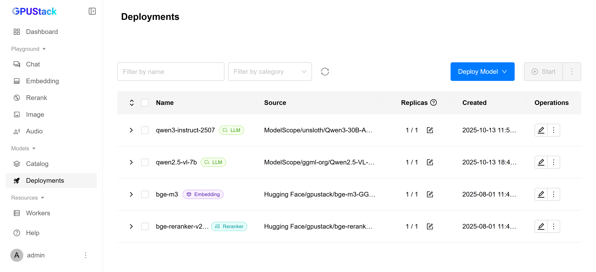
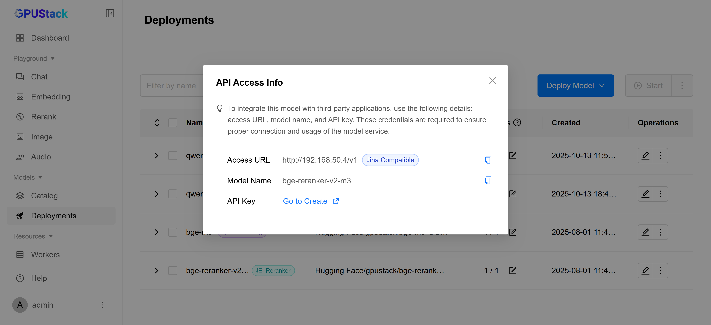
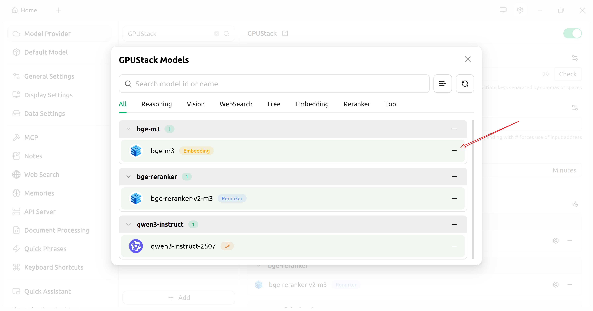
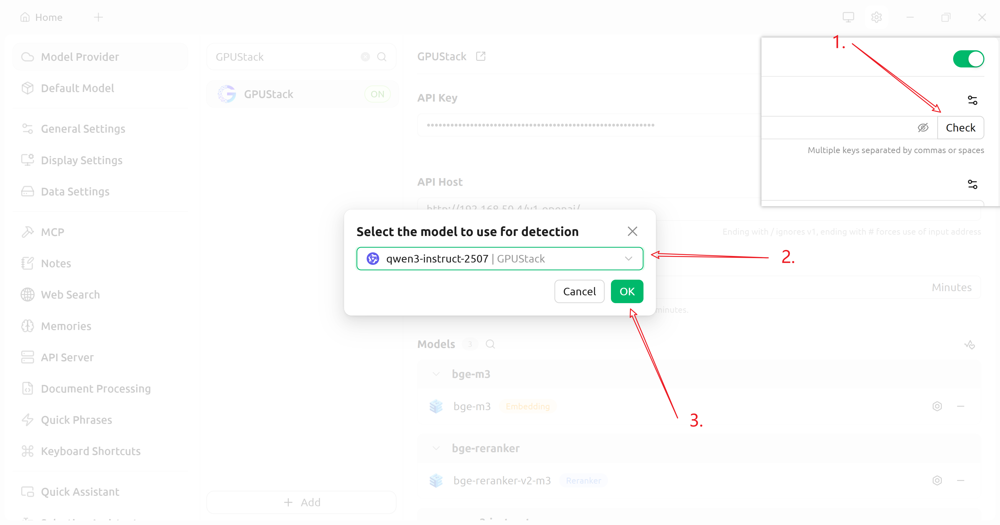
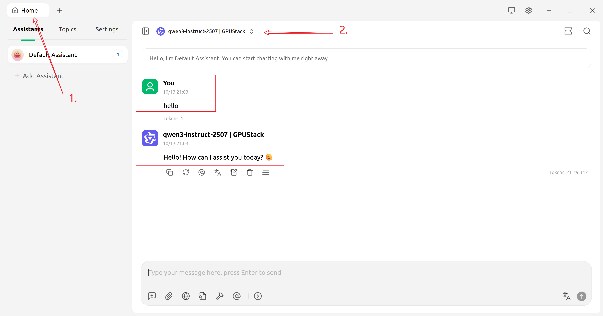
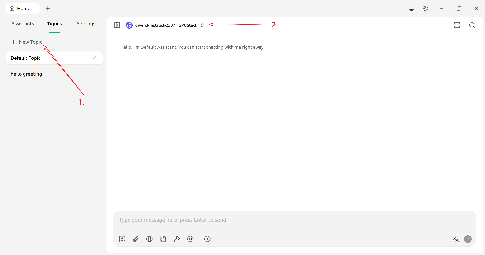
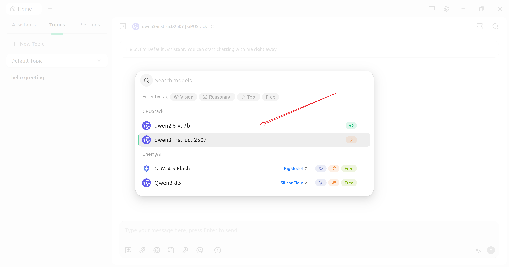
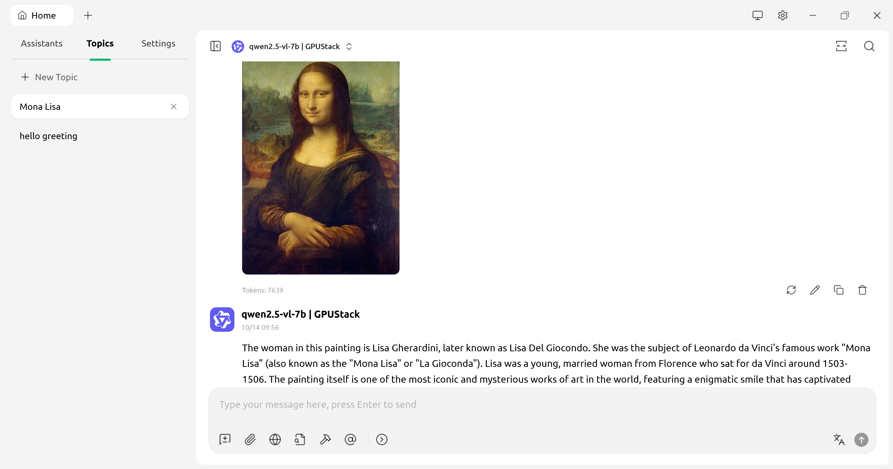
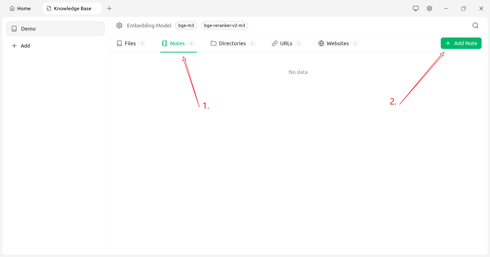

# Integrate with CherryStudio

CherryStudio integrates with GPUStack to leverage locally hosted LLMs, embeddings, and reranking.

## Deploy Models

1. In the GPUStack UI, go to the Deployments page and click Deploy Model to deploy the models you need. Example models:

    - Qwen3-30B-A3B-Instruct-2507
    - Qwen2.5-VL-7B-Instruct
    - bge-m3
    - bge-reranker-v2-m3

   

2. In the model’s Operations column, open API Access Info to view how to integrate with this model.

   

## Create an API Key

1. Hover over your avatar, go to API Keys, and click New API Key.
2. Enter a name, then click Save.
3. Copy the API key and keep it for later.

## Integrate GPUStack with CherryStudio

1. Open CherryStudio, go to Settings → Model Provider, find GPUStack, enable it, and configure it as shown:

   

2. In the GPUStack provider configuration, click Manage and enable the models you need:

   

   

   Because OpenAI does not provide a dedicated reranker model, GPUStack exposes the /rerank API under /v1 instead of /v1-openai.

   In the current GPUStack version, the /v1/models endpoint is for internal use and does not support the “list models” operation. To enable automatic model listing in CherryStudio, first set API Host to:
   http://your_host_ip/v1-openai/
   (the trailing slash is required).

   Then change API Host to:
   http://your_host_ip
   so the reranker endpoint works correctly, as shown below:

   

3. (Optional) Test the API:

   

After configuration, return to the CherryStudio home page and start using your models.

## Use LLMs

## Use Multimodal Models

1. Select a multimodal model  
   
2. Ask multimodal questions  
   
   

## Use Embeddings and Reranking to Improve Knowledge Base Q&A

1. Open the Knowledge Base configuration page  
   
2. Add a knowledge base  
   
3. Add content to the knowledge base (using “Notes” as an example)  
     
   
4. Return to the home page and use knowledge base Q&A  
   
   
